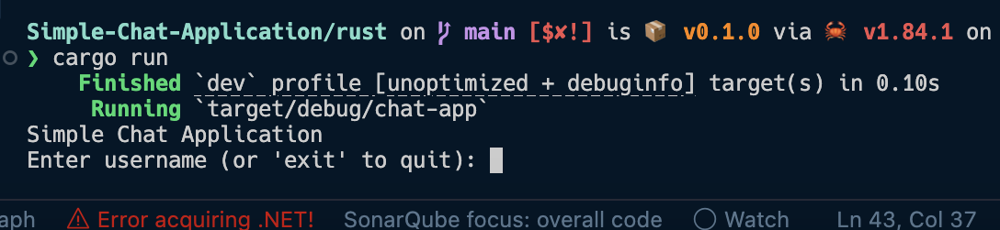
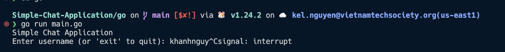

# Simple Chat Application

This repository contains two implementations of a simple chat application - one in Rust and one in Go. Both implementations provide similar functionality with their respective language-specific features.

## Features

- User registration and management
- Send and receive messages between users
- View message history
- Search messages by keyword
- List registered users
- Delete messages by keyword
- Timestamp-based message tracking

## Rust Implementation

The Rust implementation showcases:
- Memory safety through ownership and borrowing
- Structured error handling with Result types

### Running the Rust Application

```bash
cd rust
cargo run
```
the application will show the result


## Go Implementation

The Go implementation demonstrates:
- Efficient message passing
- Simple error handling

### Running the Go Application

```bash
cd go
go mod tidy
go build
./chat-app
```

the application will show the result


## Usage

Both applications provide a similar command-line interface:

1. Start the application
2. Enter a username to register/login
3. Use the following commands:
   - Send message (1)
   - View messages (2)
   - Search messages (3)
   - List users (4)
   - Delete message (5)
   - Logout (6)

## Design Considerations

- In-memory storage for simplicity
- Efficient message filtering and search
- User-friendly command-line interface
- Timestamp-based message tracking
